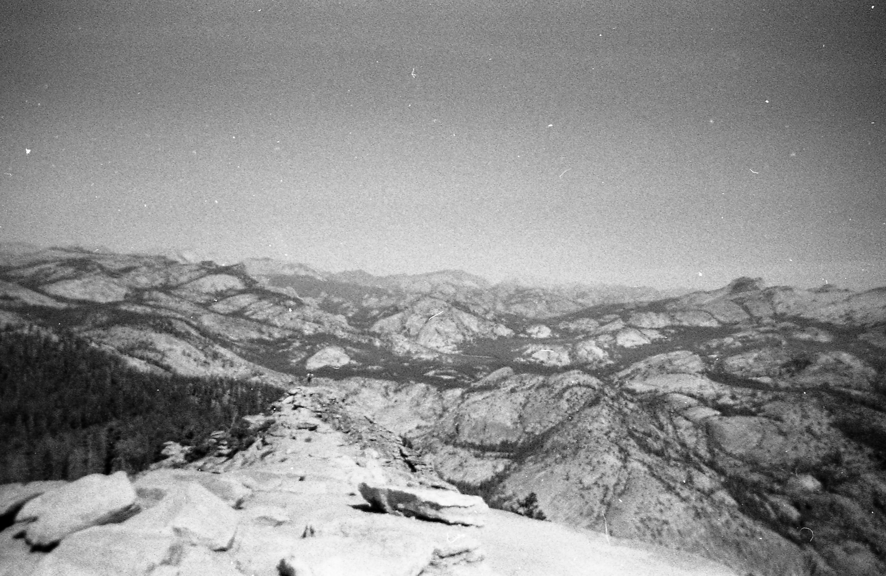
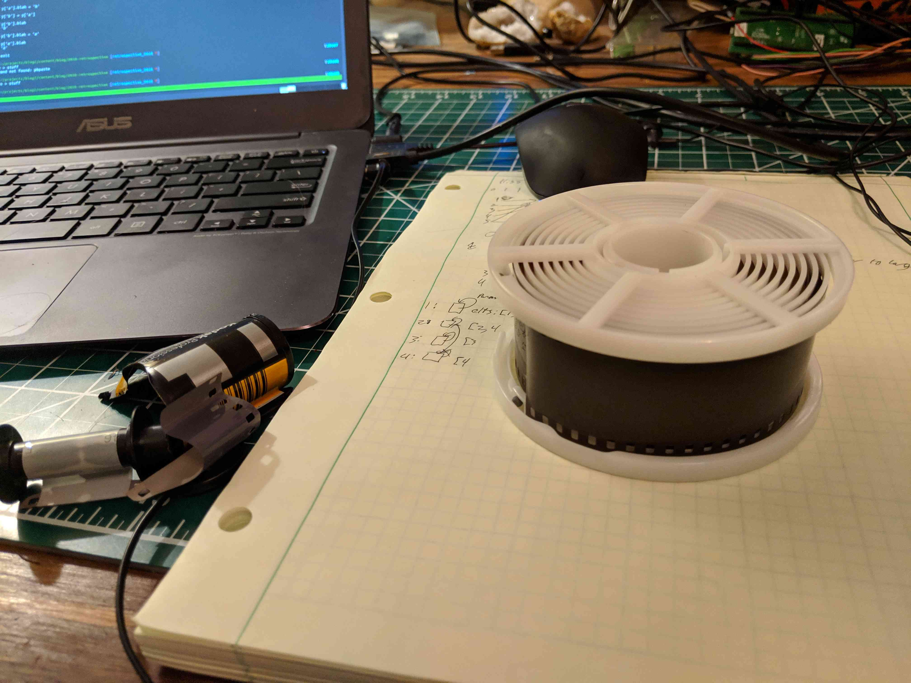
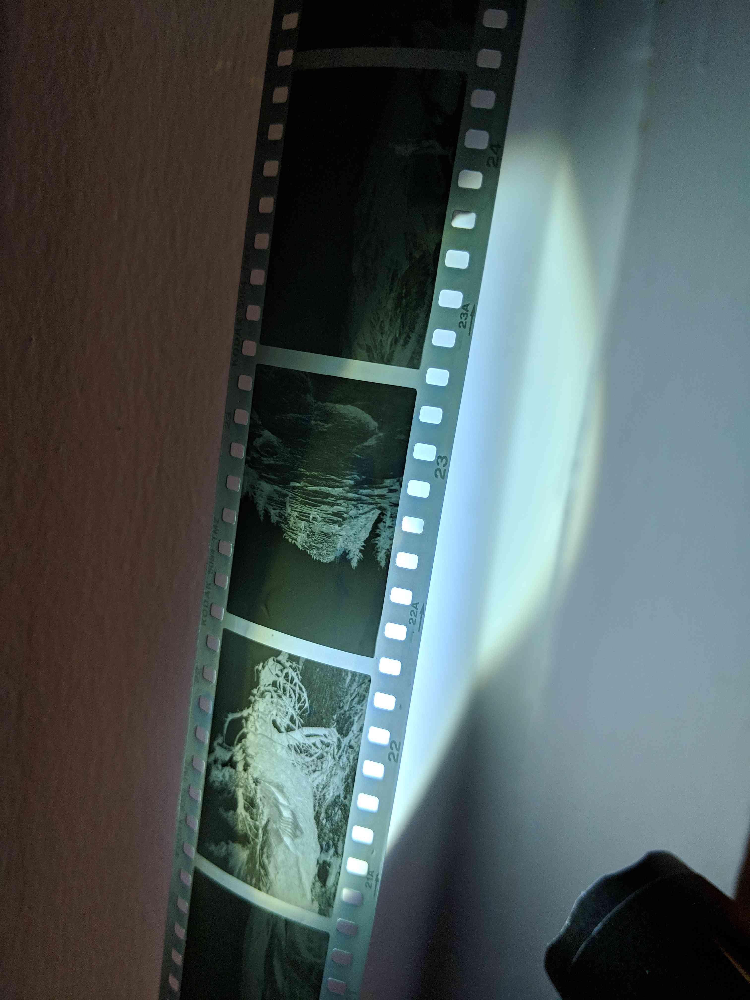

A couple of months ago I read
[*Little Fires Everywhere*](https://www.goodreads.com/book/show/34273236-little-fires-everywhere).
One of the protagonists, Mia, is an artist who develops film. Reading about her
process intrigued me, so when I saw
[this Popular Science article](https://www.popsci.com/develop-black-and-white-film)
about developing your own film I figured that I had to try it out.

A couple purchases and a borrowed film camera later, I was all set to go. As
luck would have it, a friend of a friend had an opening in a small weekend trip
to Yosemite and I was able to tag along. What an opportunity for my first foray
into film!

After arriving late Friday night, we quickly set up camp and got ready for the
next day. We woke up early on Saturday and started our hike on
[Clouds Rest](https://www.yosemitehikes.com/tioga-road/clouds-rest/clouds-rest.htm).
During the hike I was able to take a lot of fun photos of magnificent
landscapes. By the time we got back to camp I was already itching to view the
results of the photos, but alas I'd have to wait.

Fast forward a couple of months and I finally make time to develop the film. I
mix the developer and fixer chemicals at the specified temperatures and
practice removing the film from its canister in complete darkness on some
expired film. Then comes the time, I barricade myself in my closet, using
hockey tape on the door to block off any more light from entering the room, and
that's when I see something that I haven't for quite awhile, Complete Darkness.
It was so absolute that I actually started seeing small pinpricks of imagined
light where there was nothing. The experience was relaxing and satisfying.
After using a can opener to pry the top off of the film canister and feeding
the film into a light-proof container, I left my temporary burrow, tearing down
the tape that I'd used to hide the light.

The process was simple enough to follow:
* Add Developer
* Mix & Wait
* Pour Developer back
* Add Stopper
* Mix & Wait
* Add Fixer
* Remove Fixer
* Rinse with Water

[Developer](https://en.wikipedia.org/wiki/Photographic_developer) works by
interacting with Silver halides to make metallic silver, which is black.
[Stopper](https://en.wikipedia.org/wiki/Stop_bath) is mostly acetic acid which
works to stop the development of the film since the development only occurs in
a basic environment. Since it's basically vinegar, the stopper has quite a
powerful scent.
[Fixer](https://en.wikipedia.org/wiki/Photographic_fixer) removes any of the
leftover undeveloped silver halide and prevents any future fogging of the
image.

After I was done, I could finally remove the roll of film from the canister

and hang it up to dry

After that, Joey was kind enough to help me scan the
photos with his Epson scanner and pretty soon I had 38 film photos on my
computer.

Going through this process really made me appreciate the camera on my phone,
but it also formed a stronger connection between me and the photos I took. It's
pretty neat, but I suppose time will tell when I do my next batch of film
development. Until then ...

You can view all of the photos
[here](https://photos.app.goo.gl/6jqHxhX9ggg1dNDYA).
