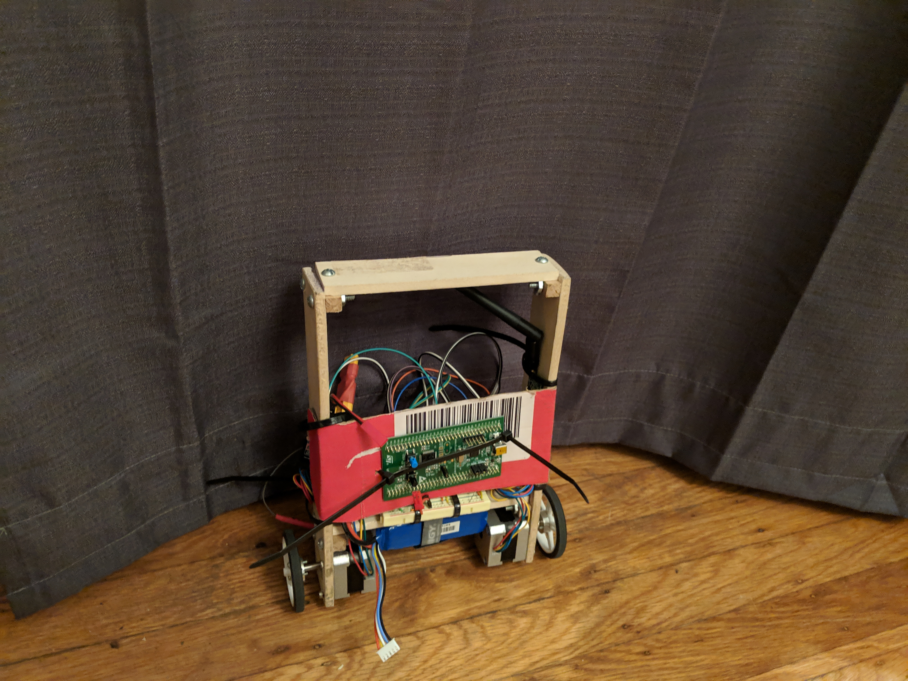
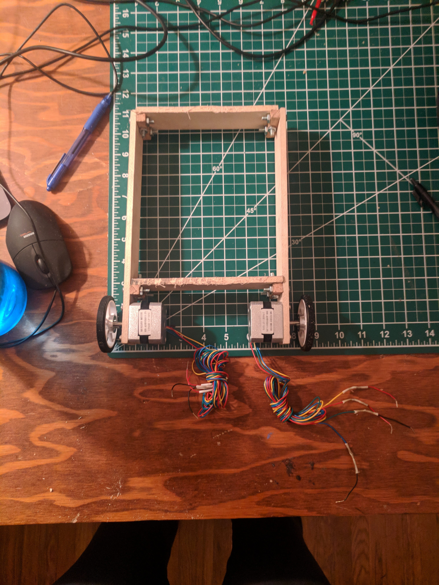

I built something and I want to talk about it!

I started this project mostly as an excuse to work with stepper motors and
refresh my PID control loop knowledge. I thought this project would take a
month at most. I was wrong.

It all began late in July; I was itching to work on some hardware and soon
enough came up with an idea for a project. I would make a tiny segway type
device that would maintain its balance despite only being on 2 wheels. I got my
inspiration from these 2 projects:
* [Dan's self-balancing robot](https://hackaday.com/2017/09/27/a-robot-that-can-still-keep-its-balance-after-a-night-in-the-pub/)
* [Joop Brokking's self-balancing robot](https://hackaday.com/2017/06/03/building-a-self-balancing-robot-made-easy/)

The system is basically composed of these 3 components:
* Speed Control
* Pose Estimation
* Control Loop

For speed control, I chose to use stepper motors because I had never actually
worked on a project with them before and wanted to play around with some. They
also avoided the issue of needing to calibrate each motor to match the speed of
the other, as I've done in the past with DC motors. I chose to use the
[DRV8825](https://www.pololu.com/product/2133/resources) stepper motor driver
which took care of the micro-stepping and the current sourcing required to use
the steppers. I made a small interface to configure direction and speed. Speed
was dictated by the frequency of a pulse on the driver, so I hooked it up to a
timer and configured the timer with the dictated frequency. Braking was
interesting because if the driver is enabled, but you aren't ticking then the
wheels will lock up. I wanted the robot to free roll when its speed was set to
zero and I was able to do that by just disabling the driver.

After I got the stepper motors working I built the frame with Brittany's help.

Then I needed a way of estimating my pose. I was going to use an old
[MPU6050](https://www.invensense.com/products/motion-tracking/6-axis/mpu-6050/)
that I had lying around, but to my dismay discovered that it had been fried
awhile ago. So, I upgraded to the 9-axis IMU, the
[MPU9250](https://www.invensense.com/products/motion-tracking/9-axis/mpu-9250/a).
Luckily, there was a wealth of resources out there that dealt with using the
MPU9250, so I adapted [this Arduino repo](https://github.com/sparkfun/SparkFun_MPU-9250_Breakout_Arduino_Library)
to work on the STM32F0 that I was using as my main processor.

After that, I setup USART to help debug the next step of the project which
involved actually setting up the I2C peripheral and communicating with the
MPU9250. I set it up as a synchronous driver to save development time and ended
up just using that implementation in the long run because there really wasn't
much to do while we were waiting for new IMU information. Once I was getting
values from the IMU I started having issues using the quaternion filter that I
found. Oh yeah, I found out that a good way of representing a pose is with a
quaternion. You can just think of a quaternion as a useful way of keeping track
of and updating an orientation in space. You then can turn that into a Euler
coordinate when you're looking for the more standard yaw, pitch, and roll
information. Getting the filter to work proved difficult for a couple of
reasons:
* Setting up the math library to get used by the build system took me an
afternoon
* I wrote my own `ftoa`, which didn't handle negative numbers properly and cost
  me more time than I'd care to say looking for issues in the filter.

The 2 lessons I learned from dealing with these issues were:
* Good displays are worth gold. Graphing the values I was getting made it about
  1000 times easier to see the issue I was having.

<iframe
	width="560" height="315"
	src="https://www.youtube.com/embed/WmMcS7Cvwww"
	frameborder="0"
	allow="accelerometer; autoplay; encrypted-media; gyroscope; picture-in-picture"
	allowfullscreen></iframe>
* I really need to lean on established solutions more often. I shouldn't have
  spent so much time dealing with a bug I introduced in a provided function. I
think the main issue I have here is that sometimes its easier to make it myself
than find a more robust implementation. Perhaps that's because I'm not looking
in the right place?

After getting the IMU information taken care of, setting up the PID loop was
fairly straightforward, especially after refreshing myself with [this great
rundown of PID loops](http://brettbeauregard.com/blog/2011/04/improving-the-beginners-pid-introduction/).
Then amazingly, it started to balance itself and it all came together.

<iframe
	width="560" height="315"
	src="https://www.youtube.com/embed/tuSZBAHPZNY"
	frameborder="0"
	allow="accelerometer; autoplay; encrypted-media; gyroscope; picture-in-picture"
	allowfullscreen></iframe>

Tuning it took a fair amount of time and I ended up removing a lot of jitter in
the original design by removing my integral windup filter. The idea behind the
original implementation was to reset the I value when passing over the
centerpoint to avoid it from pushing itself past the center too much. But, it
turns out that you actually want that I to carry over in this control loop
since it acts like momentum and softens the oscillations and jerkiness of the
system.

<iframe
	width="560" height="315"
	src="https://www.youtube.com/embed/SlCiGJosy8s"
	frameborder="0"
	allow="accelerometer; autoplay; encrypted-media; gyroscope; picture-in-picture"
	allowfullscreen></iframe>

I kept tuning it some more and even threw on a handy-dandy wireless UART
connector and made a small CLI on the device so I could tune it without being
connected. I also implemented some code to read a PPM receiver (think RC
plane/quadcopter controller) and I used this to allow me to dynamically change
the setpoint and drive it back and forth.

<iframe
	width="560" height="315"
	src="https://www.youtube.com/embed/snp5e9ZHg20"
	frameborder="0"
	allow="accelerometer; autoplay; encrypted-media; gyroscope; picture-in-picture"
	allowfullscreen></iframe>

I really enjoyed seeing this project to completion and ended up with a pretty
fun little robot. There's plenty more I could do here:
* Add a channel from the PPM controller to allow me to turn
* Improve the PID tuning
* Build a better housing
* Print a custom PCB

But, I'm happy with where it's at right now and am excited to start working on
other projects!
